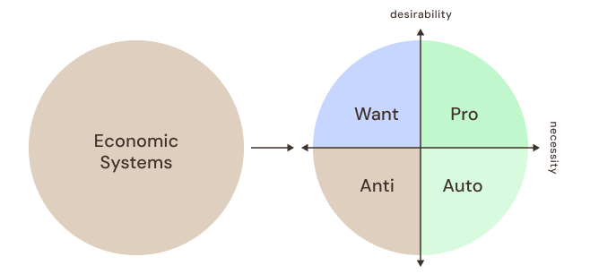

In order to transition away from ownership and debt, we need to adapt our existing economic systems to function with our new human software package.

### Catalog Existing Economic Systems
We can't waste time trying to build new systems and communities, we need to transition our existing systems and communities. To do so, we need to understand what are our economic system and how to transition them.
#### Economic System
An economic system is anything that can be owned and exchanged for debt/money. The three main categories of economic systems are: **people**, **assets**, and **land**. Additional categorization may be necessary to organize the wide variety of economic systems.

- **People Economic System** are any defined jobs. All positions a person can perform in exchange for debt/money.
- **Asset Economic Systems** are any defined items. All things a person can own and exchange for debt/money.
- **Land Economic Systems** are any defined places. All plots of land and permanent structures a person can own and exchange for debt/money.
#### Economic System Details
All economic systems contain the following details:
- Name
- Category (People, Asset, Land)
- Abstract
- Communities
- Labor Impact
- Resource Impact
- Access Impact
- Efficiency
- Catalog Priority
- Explorations
#### Catalog Priority
The catalog priority is defined by the system's necessity and desirability. Necessity is defined by the [Human Baseline](/blog/content-hb) personal and community needs:
- Personal Needs
	- Food
	- Water
	- Shelter
	- Community
- Community Needs
	- Governance
	- Logistics
	- Infrastructure
	- Healthcare
	- Education

Any economic system that does not fall within the mentioned necessary systems will be automatically considered an Unnecessary System. Desirability is defined by personal and community opinion. Each community will need to define which systems are desirable to their specific community. Desirability has no bearing on the necessity of the system. With these two parameters we can define four Catalog Priorities:
- **Want Priority Systems** are unnecessary but desirable (ex. recreation, leisure, arts) These will not count towards community labor obligation.  
- **Anti Priority Systems** are unnecessary and undesirable (ex. finance, insurance). These will be deprecated.  
- **Auto Priority Systems** are necessary but undesirable (ex. manufacturing, transit, hazardous). These will count towards community labor obligation, and be prioritized for automation.
- **Pro Priority Systems** are necessary and desirable (ex. medical, educational, engineering, design, culinary). These will count towards community labor obligation, and be prioritized for people.

### Explore System in an Equitable Community
To explore how our economic systems can be equitable, we need to frame them in the context of existing within an equitable community. Because this is purely theoretical right now, we need to be able to define what is an equitable community or at least the goal of an equitable community.
#### Equitable Community
An Equitable Community is any community where all members are legally guaranteed to equitably share the labor and access of all necessary systems. That begs the question, what is equitable? We can start with our Necessary Systems, we interact with these systems via information, labor, and access.
- **Information** is how we think about a system, all the data produced and used by the system, standardizations, regulations, and processes
- **Labor** is how we work towards a system, how we produce the goods and services that people need, maintain the systems to keep them functional, and provide a service so that the community can access the system.
- **Access** is how we interact with the systems, through open public access points and private access points.

Equity doesn't mean everyone has to work the same job or is given the same house and food. Equity means that all people within a community have the same opportunities to interact with the necessary systems. How they choose to pursue those opportunities is up to the individual and community.
#### Exploration Process
This is a difficult problem to conceptualize, it affects all aspects of life and trying to imagine how your life would change under these conditions takes a lot of effort. To help make this easier, we are using a branching narrative approach to our explorations.

We first start with a seed exploration that helps frame the solution. We have provided an example with *[[Sandbox Community A]]* that helps answer the initial questions of:
- What does equitable labor look like?
- What does equitable access look like?

You can start a new seed exploration if you have an alternative method to answer those questions. Within that exploration, other people can submit their own additions or changes with the goal to maintain all of the needs of a community equitably. Once an exploration has successfully fulfilled the goal, it can be published for communities to test and adopt.
#### Feedback Process
A major aspect of the exploration process is being able to provide constructive and actionable feedback. All explorations will need to go through rounds of feedback to properly collaborate and improve explorations. This also allows everyone to be equitably involved in the exploration process.

### Publish Approved Catalog of Equitable Systems
*From this point forward details about the Economic Transition Plan have not been defined and are still being explored internally. Any details moving forward may be subject to frequent change at any time as we define our process.*

Once an exploration has fulfilled the goal of supporting a community's needs equitably, with approval by necessary committee representatives, it is ready to be externally released for public consideration. More exploration may be done within the approved catalog, but does not prevent the use of the catalog in it's current form. Communities can take these catalogs for research and testing to see if their community can integrate these systems.
#### Approval Process
As explorations are shared and revised with rounds of feedback, the ETC will need to allow the election of necessary system representatives. These are people are publicly verified subject matter experts in their system, and can provide explicit feedback pertaining to the feasibility of the explorations.

The ETC, alongside relevant representatives, will then give approval towards individual explorations if it achieves the goal of the exploration and addresses all questions and risks involved. This process should be similar to a peer review system for academic papers.
#### Publication Process
The ETC will regularly publish approved explorations as they are ready. The first publication will come when all necessary systems have been addressed within a unified exploration (ex. Sandbox Community A and all subsequent explorations).
### Prepare Communities Transitions
Once a community has started the process of testing and integrating equitable system, the ETC is no longer necessary in the Economic Transition Plan. Communities can transition themselves individually through their own legislative process. The following information are helpful aspects to consider when making your transition.
#### Prepare Necessary Systems
Similar to the first step, the community needs to catalog all of it's own businesses and shelters. All businesses will become cooperatives, with all employees becoming equally responsible for the operations. Unnecessary businesses will be informed that their employment status does not meet the requirements for necessary community labor, and will have to find employment with a necessary coop.
#### Prepare Membership Ledger
Communities need to take census of all community members. All adults (18 years and older) must be enrolled to a necessary cooperative. All people will need to claim a private residence. If a person has existing ownership of a residence, they will lose ownership but remain in the residence after community transition. If a person does not have a residence, they will have the opportunity to select an available residence and move in after transition.
#### Prepare Equity Contracts
Taxes and local currency will become void, in place, all community members must sign a Community Equity Contract. This contract legally guarantees all community members a right to exist in the community. This right to exist comes with the obligation to equitably access and labor towards the community's necessary systems. This contract will define the terms of that access and labor.
## After Transition
As stated in the previous section, the ETC is no longer required during and after transition. Once a community has successfully legislated their Community Equity Contract, they are considered successfully transitioned. Live long and prosper.